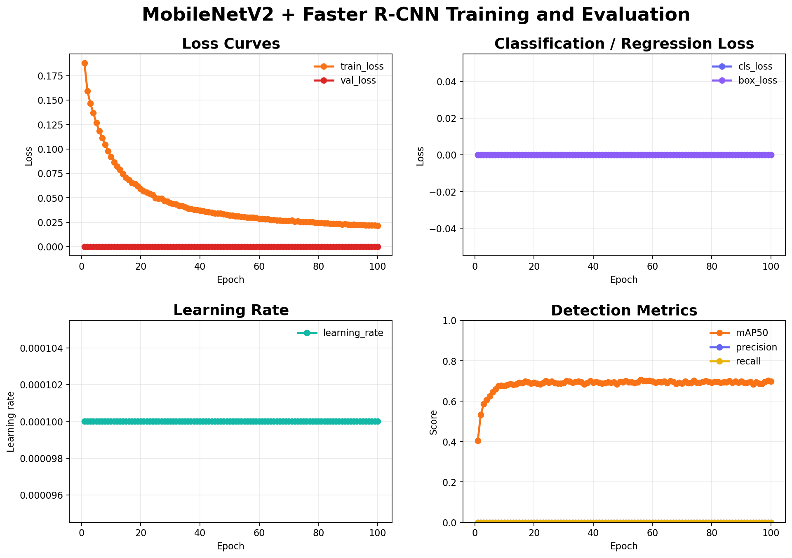

# Fire Smoke Detection using MobileNetV2 + Faster R-CNN

## 项目简介

本项目使用 MobileNetV2 作为骨干网络，结合 Faster R-CNN 实现火焰（fire）和烟雾（smoke）目标检测。

## 技术栈

- Python
- PyTorch
- Torchvision
- MobileNetV2
- Faster R-CNN
- NumPy、Pillow、Matplotlib

## Dataset

The dataset is not included due to size limitations.

The project uses YOLO format annotations:

data/
├── train/
│   ├── images/
│   └── labels/
└── val/
    ├── images/
    └── labels/

## Environment

Tested environment:

- Python 3.10
- PyTorch
- CUDA
- NVIDIA RTX GPU

## 数据集说明

数据集采用 YOLO 标注格式，预期目录结构如下：

```text
data/
├── train/
│   ├── images/
│   └── labels/
└── val/
    ├── images/
    └── labels/
```

数据集未包含在仓库中。每个标签文件使用 YOLO 格式，类别包括 fire 和 smoke。

## 模型结构

- Backbone：MobileNetV2
- Detector：Faster R-CNN
- ROI Pooling：MultiScaleRoIAlign
- 检测类别：fire、smoke

## 训练参数

| 参数 | 值 |
| --- | --- |
| Epoch | 100 |
| Batch size | 8 |
| Optimizer | AdamW |
| Learning rate | 1e-4 |

## 实验结果

| 指标 | 结果 |
| --- | ---: |
| mAP@0.5 | 0.698624 |
| mAP@0.5:0.95 | 0.362444 |
| Fire AP | 0.781061 |
| Smoke AP | 0.616186 |

## 推理速度

5.80 ms/image

## 运行方式

安装依赖：

```bash
pip install -r requirements.txt
```

训练：

```bash
python src/train.py
```

评估：

```bash
python src/evaluate.py
```

绘制曲线：

```bash
python src/plot.py
```

运行评估前，请将 `mobilenetv2_fasterrcnn.pth` 放入 `weights/` 目录。训练日志、曲线和评估结果保存在 `results/` 目录。

## Training Curve

